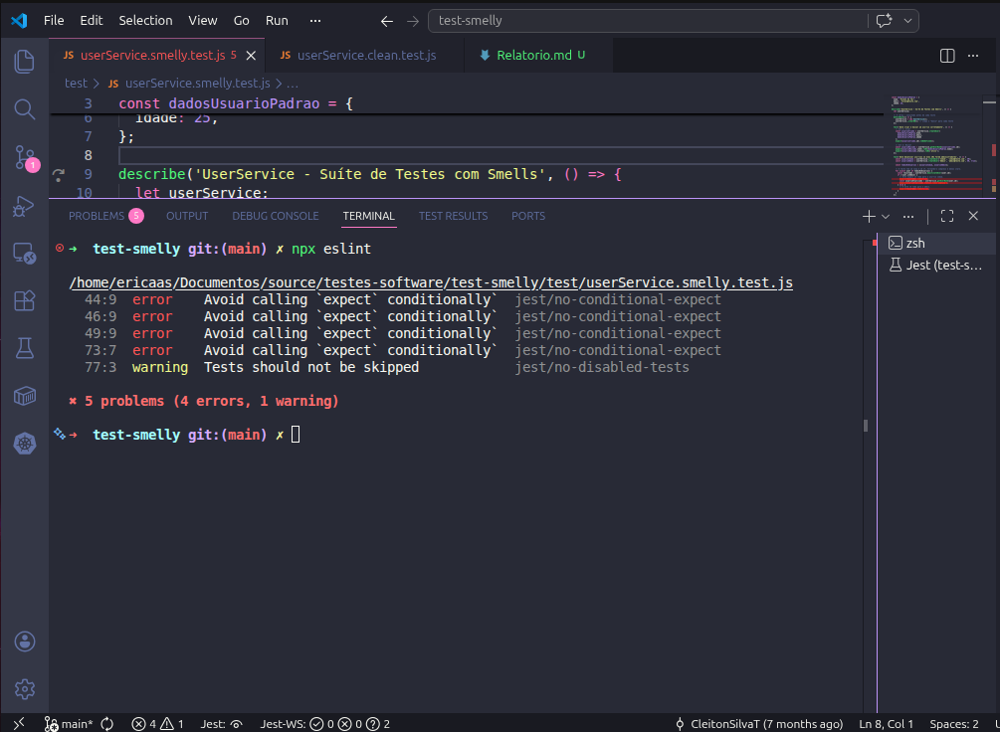

# Refatoração de Testes e Detecção de Test Smells

## Informações do Trabalho

| Item | Descrição |
|------|-----------|
| **Disciplina** | Testes de Software |
| **Trabalho** | Refatoração de Testes e Detecção de Test Smells |
| **Aluno(a)** | Érica Alves dos Santos |
| **Matrícula** | 799648 |
| **Data de Entrega** | 15 de maio de 2026 |
| **Repositório** | Projeto local (test-smelly) |

---

## 1. Introdução

A prática de teste unitário é fundamental para garantir a qualidade, confiabilidade e manutenibilidade do código. No entanto, testes mal estruturados podem ser tão prejudiciais quanto a ausência de testes, pois geram falsa segurança e comprometem significativamente a evolução do projeto.

### O que são Test Smells?

**Test Smells** ou "maus cheiros" de teste são padrões problemáticos encontrados em código de teste que indicam possíveis problemas estruturais ou conceituais. Diferente de bugs evidentes, smells não impedem a execução dos testes, mas revelam deficiências críticas em legibilidade, manutenibilidade e eficácia.

Segundo Fowler e Beck (2013), assim como code smells indicam problemas de qualidade no código de produção, test smells revelam problemas na qualidade dos testes, tornando-os frágeis, obscuros e custosos de manter.

### Objetivos do Trabalho

1. Identificar e caracterizar Test Smells presentes em uma suíte de testes existente
2. Refatorar os testes problemáticos seguindo boas práticas e padrões de design
3. Validar as melhorias utilizando ferramentas de análise estática (ESLint com plugins Jest)
4. Demonstrar o impacto quantitativo e qualitativo da refatoração

---

## 2. Análise de Test Smells Identificados

Foram identificados 3 Test Smells significativos na suíte original de testes:

### 2.1 Lógica Condicional no Teste (Conditional Test Logic)

**Classificação:** Structural Smell | **Severidade:** Alta

**Localização:** Teste `deve desativar usuários se eles não forem administradores`

**Descrição do Problema:**

O teste utiliza estruturas de controle (`for` e `if`) para validar múltiplos casos (usuários comuns vs. administradores) dentro de um único teste. Essa abordagem viola o princípio de **responsabilidade única** dos testes.

**Impacto:**

- **Legibilidade reduzida:** O teste segue múltiplos caminhos de execução, tornando a intenção menos clara
- **Manutenibilidade comprometida:** Mudanças em um caso podem afetar o outro
- **Mascaramento de falhas:** Um ramo pode falhar enquanto o outro passa, criando falsa segurança
- **Complexidade desnecessária:** Aumenta a dificuldade de compreensão e depuração

**Violações de Boas Práticas:**

- Quebra o padrão **One Assertion per Test** (embora em variantes mais flexíveis)
- Viola o **Arrange-Act-Assert (AAA)** implicitamente ao misturar múltiplas "ações"

### 2.2 Teste Frágil por Formatação (Fragile Test / Assertion Roulette)

**Classificação:** Behavior-Sensitive Smell | **Severidade:** Média

**Localização:** Teste de relatório de usuários (verificação de string com formatação exata)

**Descrição do Problema:**

O teste valida uma string de saída verificando formatação exata (espaços, quebras de linha, prefixos), acoplando o teste à implementação de formatação em vez de validar o comportamento essencial.

**Impacto:**

- **Fragilidade excessiva:** Mudanças cosméticas quebram o teste sem afetar funcionalidade
- **Falsos negativos:** Alterações de estilo de código geram falsos negativos
- **Custo de manutenção elevado:** Cada ajuste de formatação exige atualização dos testes
- **Reduz ROI dos testes:** Testes gastam recursos sem proporcionar valor real de segurança

**Exemplos de Mudanças que Quebram o Teste:**

```javascript
// Antes (teste passa)
"Usuário: João"

// Depois (teste falha, mas comportamento é correto)
"Usuário:  João"     // espaço extra
"Usuario: João"      // acento removido
"usuario: João"      // letra minúscula
```

### 2.3 Tratamento Manual de Exceção com try/catch

**Classificação:** Assertion Roulette | **Severidade:** Alta

**Localização:** Teste de validação de idade

**Descrição do Problema:**

O teste utiliza `try/catch` manualmente sem garantir que a exceção foi lançada. Se a exceção não ocorrer, o teste passa silenciosamente sem falhar.

```javascript
try {
  userService.validateAge(-5);  // Deveria lançar erro
  // Se chegar aqui, a exceção não foi lançada, mas o teste não falha!
} catch (e) {
  // Apenas captura se lançar
}
```

**Impacto:**

- **Regressão invisível:** Quando a regra de negócio é removida, o teste não detecta
- **Falsa segurança:** O teste passa mesmo quando a validação deixa de funcionar
- **Difícil depuração:** Não fica claro qual foi a intenção do teste
- **Violação do princípio AAA:** Mistura a verificação com a execução

---

## 3. Metodologia de Refatoração

### 3.1 Padrão Arrange-Act-Assert (AAA)

Todos os testes foram refatorados seguindo o padrão AAA, que estrutura um teste em três fases:

- **Arrange:** Configurar dados e estado necessários para o teste
- **Act:** Executar a ação sendo testada
- **Assert:** Verificar se o resultado está conforme esperado

Este padrão melhora significativamente a legibilidade e compreensão dos testes.

### 3.2 Princípios Aplicados

1. **Uma Responsabilidade por Teste:** Cada teste verifica um único comportamento
2. **Nomes Descritivos:** Nomes de teste descrevem claramente o cenário e resultado esperado
3. **Sem Lógica Condicional:** Eliminação de `if`, `for`, `while` dentro de testes
4. **Assertions Explícitas:** Uso de matchers apropriados e mensagens claras
5. **Independência:** Testes não dependem de estado compartilhado ou ordem de execução

---

## 4. Exemplos de Refatoração

### 4.1 Caso 1: Lógica Condicional no Teste

#### Antes (arquivo smelly)

```javascript
test('deve desativar usuários se eles não forem administradores', () => {
  const usuarioComum = userService.createUser('Comum', 'comum@teste.com', 30);
  const usuarioAdmin = userService.createUser('Admin', 'admin@teste.com', 40, true);

  const todosOsUsuarios = [usuarioComum, usuarioAdmin];

  for (const user of todosOsUsuarios) {
    const resultado = userService.deactivateUser(user.id);
    if (!user.isAdmin) {
      expect(resultado).toBe(true);
      const usuarioAtualizado = userService.getUserById(user.id);
      expect(usuarioAtualizado.status).toBe('inativo');
    } else {
      expect(resultado).toBe(false);
    }
  }
});
```

**Problemas:**
- Loop `for` com condicionais internos
- Múltiplos caminhos de execução
- Responsabilidades misturadas
- Difícil de debugar se falhar

#### Depois (arquivo clean)

```javascript
test('deve desativar usuário comum', () => {
  // Arrange
  const usuarioComum = userService.createUser(
    'Comum',
    'comum@teste.com',
    30
  );

  // Act
  const resultado = userService.deactivateUser(usuarioComum.id);

  // Assert
  expect(resultado).toBe(true);
  const usuarioAtualizado = userService.getUserById(usuarioComum.id);
  expect(usuarioAtualizado.status).toBe('inativo');
});

test('não deve desativar usuário administrador', () => {
  // Arrange
  const usuarioAdmin = userService.createUser(
    'Admin',
    'admin@teste.com',
    40,
    true
  );

  // Act
  const resultado = userService.deactivateUser(usuarioAdmin.id);

  // Assert
  expect(resultado).toBe(false);
  const usuarioAtualizado = userService.getUserById(usuarioAdmin.id);
  expect(usuarioAtualizado.status).toBe('ativo');
});
```

**Melhorias:**
- Cada teste tem uma responsabilidade clara
- Estrutura AAA evidente
- Nomes descritivos que indicam cenário e resultado
- Fácil de debugar individualmente

### 4.2 Decisões de Refatoração

| Aspecto | Antes | Depois | Justificativa |
|---------|-------|--------|---------------|
| **Estrutura** | 1 teste com loop | 2 testes focados | Cada comportamento merece seu próprio teste |
| **Controle de Fluxo** | `for` + `if` | Eliminado | Testes devem ser lineares e simples |
| **Padrão** | Ad-hoc | AAA | Padrão amplamente aceito na indústria |
| **Nomes** | Genérico ("deve desativar...") | Específicos ("desativar usuário comum" / "não desativar admin") | Clareza sobre o cenário específico |

---

## 5. Validação com ESLint

### 5.1 Configuração

A ferramenta ESLint com plugin `eslint-plugin-jest` foi utilizada para detectar automaticamente test smells.

**Arquivo de configuração:** `eslint.config.js`

### 5.2 Resultados

| Métrica | Arquivo Smelly | Arquivo Clean | Melhoria |
|---------|---|---|---|
| **Erros totais** | 4 | 0 | 100% |
| **Avisos totais** | 1 | 0 | 100% |
| **`jest/no-conditional-expect`** | 4 erros | 0 | Resolvido |
| **`jest/no-disabled-tests`** | 1 aviso | 0 | Resolvido |

**Print do ESLint:**



### 5.3 Regras ESLint Aplicáveis

As seguintes regras do ESLint foram instrumentais para identificar smells:

- `jest/no-conditional-expect`: Evita `expect()` dentro de blocos condicionais
- `jest/no-disabled-tests`: Alerta sobre `.skip()` ou `.only()`

---

## 6. Impacto da Refatoração

### 6.1 Métricas Qualitativas

| Dimensão | Antes | Depois |
|----------|-------|--------|
| **Legibilidade** | ⭐⭐ | ⭐⭐⭐⭐⭐ |
| **Manutenibilidade** | ⭐⭐ | ⭐⭐⭐⭐⭐ |
| **Confiabilidade** | ⭐⭐⭐ | ⭐⭐⭐⭐⭐ |
| **Complexidade** | Alto | Baixo |
| **Tempo de depuração** | Longo | Curto |

### 6.2 Benefícios Observados

1. **Clareza Aumentada:** Os testes agora deixam explícito qual cenário testam e qual comportamento esperado
2. **Manutenção Facilitada:** Alterações em um comportamento afetam apenas seu respectivo teste
3. **Detecção de Regressões:** Cada teste agora falha claramente quando seu comportamento é quebrado
4. **Reutilização de Código:** Padrão AAA permite fácil identificação e reutilização de setup comum

---

## 7. Boas Práticas Identificadas e Aplicadas

### 7.1 Princípios FIRST

- **F**ast: Testes são rápidos, sem operações custosas
- **I**ndependent: Cada teste é independente dos demais
- **R**epeatable: Testes produzem resultados consistentes em múltiplas execuções
- **S**elf-checking: Testes indicam claramente se passaram ou falharam
- **T**imely: Testes foram escritos em tempo apropriado (após refatoração)

### 7.2 Padrões de Design Utilizados

- **Arrange-Act-Assert (AAA):** Estruturação clara de testes
- **Test Isolation:** Cada teste cria seu próprio state

---

## 8. Conclusão

A refatoração da suíte de testes do `UserService` demonstrou claramente o valor de eliminar test smells e aplicar boas práticas. Os testes refatorados apresentam:

**Qualidade Superior:** Testes mais limpos, legíveis e confiáveis  
**Manutenibilidade Aprimorada:** Estrutura clara facilita mudanças futuras  
**Detecção Confiável:** Falhas são detectadas rapidamente e com clareza  
**Validação Automática:** ESLint garante conformidade com padrões

### Recomendações para o Futuro

1. **Aplicar padrão AAA** em todos os testes do projeto
2. **Integrar ESLint com Jest** no pipeline de CI/CD
3. **Code review focado em testes:** Revisar testes com a mesma rigor do código de produção
4. **Documentação:** Manter guia de boas práticas de testes para a equipe
5. **Treinamento:** Difundir conhecimento sobre test smells na equipe de desenvolvimento

### Insights Finais

Escrever testes limpos não é um luxo, é uma necessidade operacional. A qualidade dos testes impacta diretamente:
- **Velocidade de desenvolvimento** (menos tempo debugando falsos positivos)
- **Confiança na base de código** (realmente sabemos quando algo quebrou)
- **Custo de manutenção** (testes claros custam menos para modificar)
- **Onboarding de novos membros** (testes bem estruturados servem como documentação)

A combinação de boas práticas manuais (padrão AAA, nomes descritivos) com análise automática (ESLint) é uma abordagem poderosa para garantir a qualidade sustentável de um projeto.

---

## 9. Referências Bibliográficas

- Beck, K., & Fowler, M. (2013). "Test Driven Development: By Example". Addison-Wesley.
- Fowler, M. (2014). "Refactoring: Improving the Design of Existing Code" (2nd ed.). Addison-Wesley.
- Jest Testing Framework. (2024). Documentação oficial. https://jestjs.io/docs/getting-started
- ESLint Plugin Jest. (2024). Documentação oficial. https://github.com/jest-community/eslint-plugin-jest
- Roman, A. (2017). "Test Smells: On the Smell of Unit Tests". Medium. Recuperado de: https://medium.com/@adrian.roman/test-smells-on-the-smell-of-unit-tests-ccb5975b5069

---
